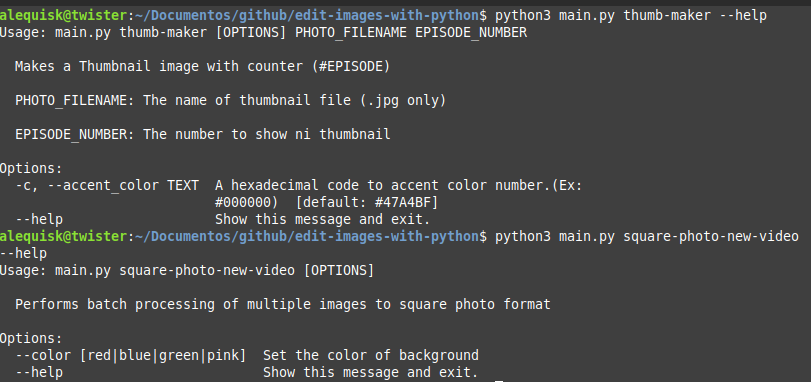

# Editing images with python



## [pt-br]
### Descrição

Esse projeto foi desenvolvido para fornecer uma ferramenta de rápida edição de imagens escrita da linguagem Python. Com ela é possível adicionar um fundo a uma thumbnail de vídeo de youtube ou quaisquer outras imagens que possuam as mesmas dimensões que o formato padrão de thumbnail para YouTube. Ele foi criado para agilizar as divulgações de novos vídeos nas redes sociais que possuem o padrão popular de posts 'squares'.

### Modo de usar

> :warning: A utilização da CLI requer que exista uma instalação do python na versão 3.10 ou superior. 

Este projeto possui duas CLI integradas ao arquivo main.py.
- **thumb-maker**: Responsável por criar enumeradores para uma thumbnail, ou seja, vídeos que são separados em partes e possuem a mesma thumbnail com a presença de números indicando qual parte aquele video se refere.
- **square-photo-new-video**: Criação rápida em lote de posts 'squares' para todos os arquivos .jpg presentes na pasta do arquivo main.py. Com ele é possível determinar qual cor de fundo será usado para todas os posts gerados.

Para informações gerais de uso, pode-se escrever o comando `python main.py` que será apresentado os comandos que poderão ser usados (os mesmos já pontuados).

```commandline
python main.py thumb-maker nome_do_capa.jpg episodio 

python main.py thumb-maker capa.jpg 1
python main.py thumb-maker --accent_color #FF0000 capa.jpg 2
```

```commandline
python main.py square-photo-new-video
python main.py square-photo-new-video --color blue
```


## [en]
### Description 

This project was developed to provide a fast image editing tool written in the Python language. With it, you can add a background to a YouTube video thumbnail or any other images that have the same dimensions as the standard thumbnail format for YouTube. It was created to speed up the dissemination of new videos on social networks that have the popular pattern of 'squares' posts.

> :warning: Using the CLI requires a Python installation of version 3.10 or higher.

This project has two CLI integrated into the main.py file.
- **thumb-maker**: Responsible for creating enumerators for a thumbnail, that is, videos that are separated into parts and have the same thumbnail with the presence of numbers indicating which part that video refers to.
- **square-photo-new-video**: Quick batch creation of 'squares' posts for all .jpg files present in the main.py file folder. With it you can determine which background color will be used for all generated posts.

For general usage information, you can write the python main.py command which will display the commands that can be used (the same ones already mentioned).

```commandline
python main.py thumb-maker cover_name.jpg episode 

python main.py thumb-maker cover.jpg 1
python main.py thumb-maker --accent_color #FF0000 cover.jpg 2
```

```commandline
python main.py square-photo-new-video
python main.py square-photo-new-video --color blue
```
